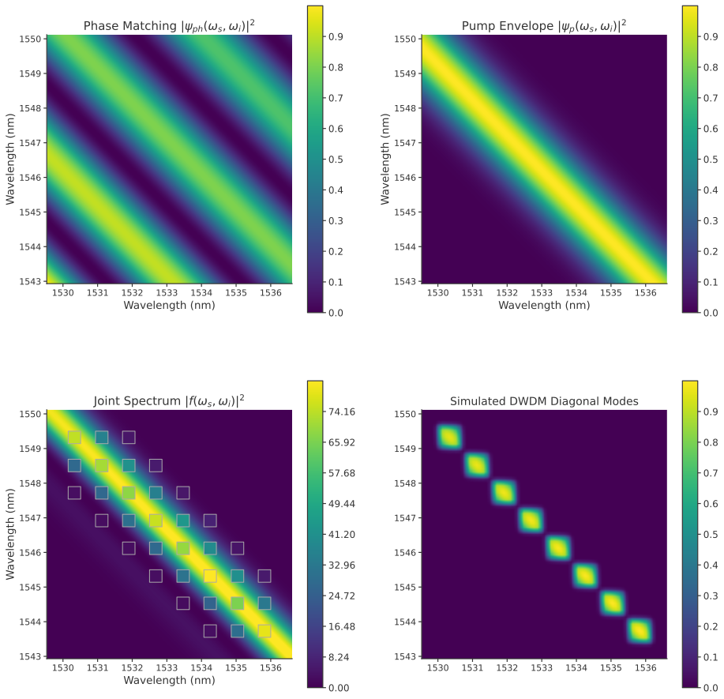

## Model of SPDC Joing Spectral Intensity (JSI) under Collinear Quasi-phase Matched Assumptions

For the paper _High Rate Time Bin Multiplexed Entanglement Source for Advanced Quantum Networks_ (to be published)

Based on these papers:

1. [Improved Heralded Single-Photon Source with a Photon-Number-Resolving Superconducting Nanowire Detector](https://journals.aps.org/prapplied/abstract/10.1103/PhysRevApplied.18.064007)
2. [Modelling parametric down-conversion yielding spectrally pure photon pairs](https://opg.optica.org/oe/fulltext.cfm?uri=oe-24-3-2712&id=335990)
3. [Joint spectral characterization of photon-pair sources](https://www.tandfonline.com/doi/abs/10.1080/09500340.2018.1437228?journalCode=tmop20)

